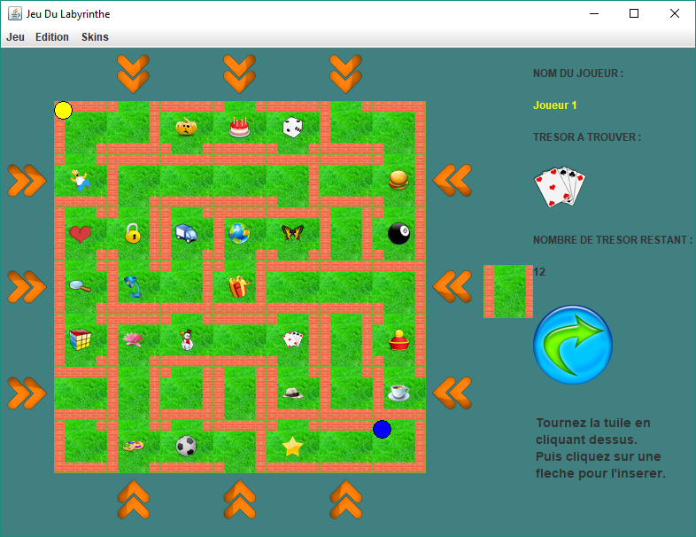

# Labyrinthe (School project 2008-2009 at IUT de Montreuil)

## Important
Ce projet date de 2009 et a été développé dans le cadre d'un projet de fin d'études.

Projet mis à disposition pour information uniquement.

Cette branche contient un mode solo (buggé).

## Comment compiler
 Exécuter `javac JeuDuLabyrinthe.java`.

## Comment jouer
Exécuter `java JeuDuLabyrinthe`.

## Capture d'écran

